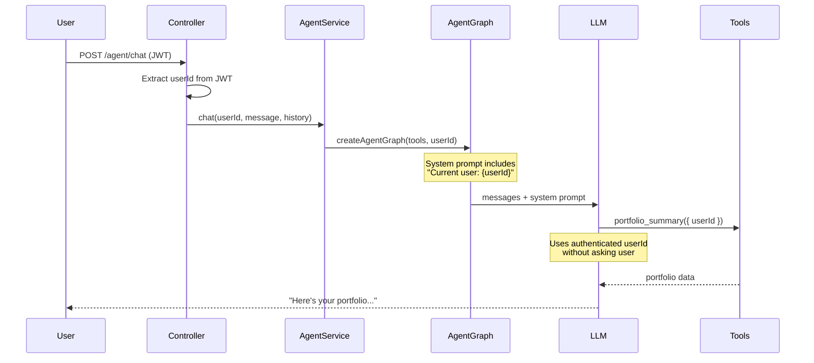

# Auto-inject Authenticated User ID into Agent Context

## Problem

The controller at `[apps/api/src/app/endpoints/agent/agent.controller.ts](apps/api/src/app/endpoints/agent/agent.controller.ts)` extracts `userId` from the JWT, and `[agent.service.ts](libs/agent/src/lib/agent.service.ts)` receives it — but it's only used for logging and Langfuse tracing. The agent graph is invoked with just `{ messages }` (line 103), so the LLM has no idea who the logged-in user is and asks them for their user ID.

## Solution

Make the system prompt userId-aware by threading the authenticated `userId` through to `createAgentGraph`.

## Changes

### 1. `libs/agent/src/lib/agent.graph.ts` — Dynamic system prompt

Convert `SYSTEM_PROMPT` from a static string to a function `buildSystemPrompt(userId: string)`:

- Add a new section to the prompt:

```
CURRENT USER:
The logged-in user's ID is: {userId}
When the user asks about "my portfolio", "my holdings", "my performance", etc., use this userId automatically. Do NOT ask the user for their ID.
```

- Update `createAgentGraph` signature to `createAgentGraph(tools, userId)` and call `buildSystemPrompt(userId)`.

### 2. `libs/agent/src/lib/agent.service.ts` — Pass userId through

- `buildGraph()` becomes `buildGraph(userId: string)` (line 65)
- Pass `userId` into `createAgentGraph(tools, userId)` (line 78)
- In `chat()`, call `this.buildGraph(userId)` instead of `this.buildGraph()` (line 86)

That's it — two files, ~10 lines changed. The tool Zod schemas stay the same (they still accept `userId` for congressional portfolio lookups), but now the LLM knows the default userId for "my portfolio" queries.




