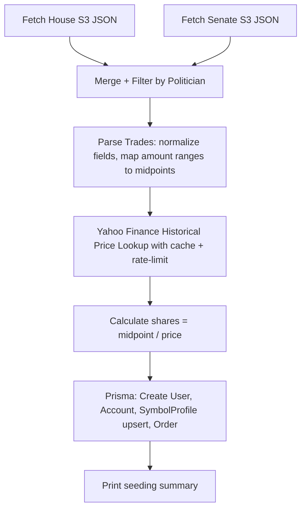

# Phase 6: Congressional Portfolio Seeding

## Goal

Populate the database with real congressional trade portfolios (6 politicians) for use as verifiable eval test data in Phase 7.

## Data Sources

- **House**: `https://house-stock-watcher-data.s3-us-west-2.amazonaws.com/data/all_transactions.json`
  - Fields: `representative`, `transaction_date` (MM/DD/YYYY), `ticker`, `type` (purchase/sale), `amount` (range string)
- **Senate**: `https://senate-stock-watcher-data.s3-us-west-2.amazonaws.com/aggregate/all_transactions.json`
  - Fields: `senator` (instead of `representative`), similar structure otherwise

## Target Politicians


| Name                   | Chamber | Archetype                  |
| ---------------------- | ------- | -------------------------- |
| Nancy Pelosi           | House   | Tech-heavy, high performer |
| Tommy Tuberville       | Senate  | High-frequency trader      |
| Dan Crenshaw           | House   | Diversified, moderate      |
| Ron Wyden              | Senate  | Diversified                |
| Marjorie Taylor Greene | House   | Concentrated (Tesla-heavy) |
| Josh Gottheimer        | House   | Financials-focused         |


## Architecture




## File to Create

### `[prisma/seed-congressional-portfolios.ts](prisma/seed-congressional-portfolios.ts)`

Single standalone script (matching the pattern of existing `[prisma/seed.mts](prisma/seed.mts)`) using `PrismaClient` directly. Organized internally into clear sections:

**1. Constants and Types**

- `POLITICIANS` map: name string to `{ chamber: 'house' | 'senate', nameVariants: string[] }` — nameVariants handles disclosure name format differences (e.g., "Pelosi, Nancy" vs "Hon. Nancy Pelosi")
- `AMOUNT_RANGE_MIDPOINTS` map: the 8 range strings from the buildguide mapped to dollar midpoints
- TypeScript interfaces for raw House/Senate trade JSON shapes

**2. Data Fetching**

- `fetchHouseTrades()`: GET the House S3 URL, return parsed JSON array
- `fetchSenateTrades()`: GET the Senate S3 URL, return parsed JSON array
- `normalizeTrades()`: Merge both datasets into a unified shape: `{ politician, ticker, date, type: 'BUY'|'SELL', amountRange }`
  - House: `representative` field, `type` = "purchase" / "sale_full" / "sale_partial"
  - Senate: `senator` field, `type` = "Purchase" / "Sale"
  - Normalize date from MM/DD/YYYY to ISO string
  - Filter to only the 6 target politicians (fuzzy match on nameVariants)
  - Skip trades where `ticker` is `'--'`, empty, or contains spaces (not a real ticker)

**3. Price Lookup with Caching**

- Use `yahoo-finance2` directly (already installed at v3.13.0) via the `chart()` API, matching how Ghostfolio's own `[yahoo-finance.service.ts](apps/api/src/services/data-provider/yahoo-finance/yahoo-finance.service.ts)` uses it (line 133)
- Build an in-memory cache: `Map<string, number>` keyed by `${symbol}-${date}` to avoid duplicate lookups
- Add 200ms delay between Yahoo Finance requests to avoid rate limiting
- If lookup fails (delisted, no data), log a warning and skip the trade
- If the exact date has no data (weekend/holiday), try the next 3 business days

**4. Database Seeding**

Following the patterns in `[prisma/schema.prisma](prisma/schema.prisma)`:

- **Create User** for each politician: `prisma.user.create()` with `provider: 'ANONYMOUS'`, `role: 'USER'`, an Account (name = politician's name + " Congressional Portfolio", currency "USD"), and Settings (`{ currency: 'USD' }`)
  - Use `upsert` keyed on a deterministic UUID derived from politician name (so the script is idempotent)
- **Upsert SymbolProfile** for each unique ticker: `prisma.symbolProfile.upsert()` with `where: { dataSource_symbol: { dataSource: 'YAHOO', symbol } }`, creating with `currency: 'USD'`, `dataSource: 'YAHOO'`
- **Create Orders** via `prisma.order.createMany()` with `skipDuplicates: true`:
  - `type`: `BUY` or `SELL` (mapped from raw data)
  - `quantity`: `midpoint / unitPrice`, rounded to whole shares
  - `unitPrice`: historical close price from Yahoo
  - `fee`: 0
  - `date`: trade date as DateTime
  - Link to `userId`, `accountId` (composite key `id_userId`), `symbolProfileId`

**5. Summary Output**

After all records are created, query and print:

```
Seeded Nancy Pelosi: 47 trades, est. value $3.2M
Seeded Tommy Tuberville: 312 trades, est. value $8.1M
...
```

## Key Implementation Details

- **Idempotency**: The script uses deterministic UUIDs for users (generated from politician name via a hash) and `skipDuplicates`/`upsert` everywhere, so it can be re-run safely
- **SymbolProfile unique constraint**: `@@unique([dataSource, symbol])` on the model means upsert on that composite key is the correct pattern
- **Order composite FK**: The Account model has `@@id([id, userId])`, so orders linking to accounts need both `accountId` and `accountUserId`
- **No NestJS bootstrap needed**: Direct PrismaClient usage keeps the script fast and dependency-free (no need to spin up the full app)
- **Rate limiting**: 200ms sleep between Yahoo Finance `chart()` calls. For ~500 total trades across 6 politicians, that's ~100 seconds of throttle time
- **Error tolerance**: Failed price lookups are logged and skipped (with counter). The script should succeed even if 10-20% of lookups fail on old/delisted tickers

## npm Script

Add to `package.json`:

```json
"database:seed:congress": "npx tsx prisma/seed-congressional-portfolios.ts"
```

`tsx` is recommended over `ts-node` for running standalone `.ts` files in this monorepo since it handles ESM/CJS interop cleanly. We may need to install it as a devDependency if not already present.

## Verification

After running the script:

1. `npx prisma studio` to visually inspect the 6 new users, their accounts, and orders
2. Start the dev server and confirm the congressional portfolios appear in the Ghostfolio UI
3. Query the agent: "What are the top holdings in the Pelosi portfolio?" should now return real data

