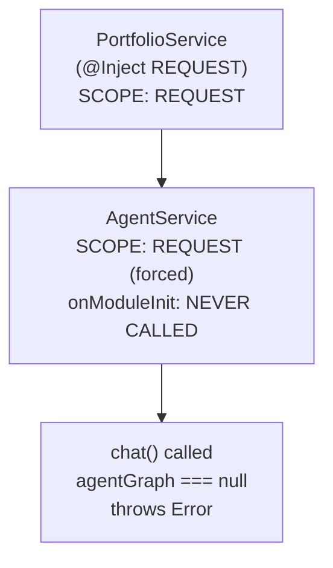

# Fix Agent Chat 500: "Agent graph not initialized"

## Root Cause

`PortfolioService` uses `@Inject(REQUEST)` ([apps/api/src/app/portfolio/portfolio.service.ts:116](apps/api/src/app/portfolio/portfolio.service.ts)), making it **request-scoped**. NestJS propagates this scope upward: since `AgentService` depends on `PortfolioService`, NestJS forces `AgentService` to be request-scoped too (fresh instance per HTTP request).

**Request-scoped providers do NOT receive `onModuleInit()` lifecycle hooks.** So `this.agentGraph` stays `null` on every request, and `chat()` always throws "Agent graph not initialized".




## Fix Strategy

Move graph + tool creation from `onModuleInit()` into the `chat()` method itself. Each request gets a fresh graph wired to the correct request-scoped service instances. This is cheap -- `createReactAgent` is synchronous and just builds a state machine; the real cost is the LLM API call.

Langfuse init moves to a module-level lazy singleton since it doesn't depend on request context.

## Changes

### 1. `libs/agent/src/lib/agent.service.ts`

- Remove `implements OnModuleInit` and the `onModuleInit()` method
- Add a private `buildGraph()` method that creates tools + graph from the injected (request-scoped) services
- Call `buildGraph()` at the start of `chat()`
- Move Langfuse to a lazy module-level singleton:

```typescript
let langfuseSingleton: Langfuse | null = null;
function getLangfuse(): Langfuse | null {
  if (langfuseSingleton) return langfuseSingleton;
  if (process.env['LANGFUSE_PUBLIC_KEY'] && process.env['LANGFUSE_SECRET_KEY']) {
    langfuseSingleton = new Langfuse({
      publicKey: process.env['LANGFUSE_PUBLIC_KEY'],
      secretKey: process.env['LANGFUSE_SECRET_KEY']
    });
  }
  return langfuseSingleton;
}
```

- In `chat()`, replace `this.langfuse` with `getLangfuse()`
- Remove the `agentGraph` and `langfuse` instance fields

### 2. No changes needed to:

- `agent.graph.ts` -- `createAgentGraph()` is fine as-is
- `agent.controller.ts` -- already catches errors properly
- Tool files -- they already accept services as parameters
- `agent.module.ts` -- module structure is correct

