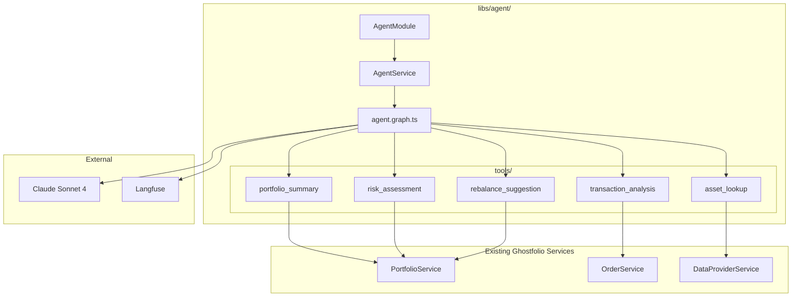

# Phase 3: Build the Agent Library

Corresponds to **Steps 9-13** of the [buildguide](/.cursor/plans/buildguide.md) (lines 163-302).

**Estimated time:** 3-4 hours with AI assistance.

---

## Pre-Step: Mark Phase 1 and 2 as Complete in Buildguide

Add progress markers (`[x] COMPLETED`) to the buildguide at the top of Phase 1 and Phase 2 sections so we can track where we are at a glance.

---

## Step 1: Scaffold the Nx Library (`libs/agent/`)

The `@nx/nest` generator may not be installed. We'll scaffold manually (which the buildguide itself suggests as a fallback). Create this structure:

```
libs/agent/
  src/
    lib/
      tools/            (Step 3)
      agent.module.ts
      agent.service.ts  (Step 5)
      agent.graph.ts    (Step 4)
    index.ts            (barrel export)
  project.json
  tsconfig.lib.json
  jest.config.ts
```

Key wiring:

- **[tsconfig.base.json](tsconfig.base.json):** Add path alias `"@ghostfolio/agent/*": ["libs/agent/src/lib/*"]`
- **[libs/agent/project.json](libs/agent/project.json):** Model after [libs/common/project.json](libs/common/project.json) (lint + test targets)
- **[libs/agent/src/lib/agent.module.ts](libs/agent/src/lib/agent.module.ts):** NestJS `@Module` that imports `PortfolioModule`, `OrderModule`, `DataProviderModule`, etc.
- **[libs/agent/src/index.ts](libs/agent/src/index.ts):** Barrel export for `AgentModule`, `AgentService`

---

## Step 2: Install Dependencies

```bash
npm install @langchain/core @langchain/anthropic @langchain/langgraph langfuse-langchain zod
```

These go in the monorepo root `package.json`. All libs share root `node_modules`.

---

## Step 3: Build the 5 Agent Tools

Each tool lives in `libs/agent/src/lib/tools/` and wraps an existing Ghostfolio service.

**Critical pattern:** Tools cannot use NestJS DI directly (they're plain functions). Instead, each tool will be a **factory function** that accepts injected services and returns a `DynamicStructuredTool`. The `AgentService` (which IS injectable) will instantiate them in `onModuleInit()`.

### Buildguide vs Reality: Key Corrections


| Buildguide Says                                         | Actual                                                                |
| ------------------------------------------------------- | --------------------------------------------------------------------- |
| Use `@AuthUser` decorator                               | Use `@Inject(REQUEST)` with `RequestWithUser`                         |
| `PortfolioService.getDetails()` takes `userId`          | Also requires `impersonationId` (pass `''` for no impersonation)      |
| `OrderService.getOrders()` takes `userId + dateRange`   | Also requires `userCurrency`, `startDate`/`endDate` as `Date` objects |
| `DataProviderService.getQuotes()` takes `symbol` string | Takes `AssetProfileIdentifier[]` with `{ dataSource, symbol }`        |


### Tool 1: `portfolio-summary.tool.ts`

- **Factory signature:** `createPortfolioSummaryTool(portfolioService: PortfolioService)`
- **Zod input:** `{ userId: z.string() }`
- **Calls:** `portfolioService.getDetails({ userId, impersonationId: '', withSummary: true })` and `portfolioService.getPerformance({ userId, impersonationId: '' })`
- **Returns:** JSON with total value, holdings list (symbol, name, allocation%, value, quantity), performance (1d, 1m, ytd, 1y)
- **Reference:** The existing AI service at [apps/api/src/app/endpoints/ai/ai.service.ts](apps/api/src/app/endpoints/ai/ai.service.ts) already calls `portfolioService.getDetails()` — use that as a pattern

### Tool 2: `transaction-analysis.tool.ts`

- **Factory signature:** `createTransactionAnalysisTool(orderService: OrderService)`
- **Zod input:** `{ userId: z.string(), startDate: z.string().optional(), endDate: z.string().optional(), userCurrency: z.string().default('USD') }`
- **Calls:** `orderService.getOrders({ userId, startDate, endDate, userCurrency })`
- **Returns:** trade count, buy/sell breakdown, total fees, most traded symbols

### Tool 3: `asset-lookup.tool.ts`

- **Factory signature:** `createAssetLookupTool(dataProviderService: DataProviderService)`
- **Zod input:** `{ symbol: z.string(), dataSource: z.string().default('YAHOO') }`
- **Calls:** `dataProviderService.getQuotes({ items: [{ dataSource, symbol }] })` + `dataProviderService.getHistorical([{ dataSource, symbol }], 'day', oneYearAgo, now)`
- **Returns:** current price, 52-week high/low, basic info

### Tool 4: `risk-assessment.tool.ts`

- **Factory signature:** `createRiskAssessmentTool(portfolioService: PortfolioService)`
- **Zod input:** `{ userId: z.string() }`
- **Calls:** `portfolioService.getDetails({ userId, impersonationId: '' })`
- **Returns:** concentration risk (>25% in one holding), sector allocation, geographic diversification, risk flags

### Tool 5: `rebalance-suggestion.tool.ts`

- **Factory signature:** `createRebalanceSuggestionTool(portfolioService: PortfolioService)`
- **Zod input:** `{ userId: z.string(), targetAllocation: z.record(z.string(), z.number()) }`
- **Calls:** `portfolioService.getDetails({ userId, impersonationId: '' })`
- **Returns:** current vs target allocation diff, specific trade suggestions with dollar amounts (READ-ONLY, no execution)

### Barrel export: `tools/index.ts`

Export all 5 factory functions from a single barrel file.

---

## Step 4: Build the LangGraph Agent (`agent.graph.ts`)

- Use `createReactAgent` from `@langchain/langgraph/prebuilt`
- Instantiate `ChatAnthropic` with model `'claude-sonnet-4-20250514'`, reading `ANTHROPIC_API_KEY` from `process.env`
- System prompt should:
  1. Identify as a Ghostfolio financial assistant
  2. ALWAYS use tools for data (never fabricate numbers)
  3. Prohibit buy/sell recommendations
  4. Require disclaimer: "I am not a financial advisor"
  5. Include confidence scoring (Low/Medium/High)
- Wire in `CallbackHandler` from `langfuse-langchain` for observability, reading `LANGFUSE_`* env vars
- Export `createAgentGraph(tools: StructuredTool[])` returning the compiled graph

---

## Step 5: Create the NestJS Agent Service (`agent.service.ts`)

- `@Injectable()` class with constructor injection of:
  - `PortfolioService`
  - `OrderService`
  - `DataProviderService`
- `OnModuleInit` lifecycle hook: instantiate all 5 tools via factory functions, then create the agent graph
- Expose `chat(userId: string, message: string, history?: BaseMessage[])` method:
  1. Build message array: system prompt + history + new HumanMessage
  2. Invoke the agent graph with Langfuse callback
  3. Return `{ response: string, toolCalls: string[], tokensUsed: number, confidence: string }`
- Log every invocation (userId, input, output, latency, tokens) to console

---

## Step 6: Wire the Agent Module (`agent.module.ts`)

```typescript
@Module({
  imports: [
    PortfolioModule,
    OrderModule,
    DataProviderModule,
    // ... other required modules
  ],
  providers: [AgentService],
  exports: [AgentService],
})
export class AgentModule {}
```

Import this module into the API app module so it's available for Phase 4's controller.

---

## Architecture Overview




---

## Implementation Order

The recommended order minimizes forward-references and allows incremental testing:

1. Scaffold library + install deps (Steps 1-2)
2. Build `portfolio-summary` tool first (simplest, reference in existing AI service)
3. Build remaining 4 tools
4. Build the LangGraph agent graph
5. Build the NestJS service
6. Wire the module and verify it compiles with `npx nx lint agent`

---

## Notes

- **No controller in Phase 3.** The chat API endpoint and UI come in Phase 4. Phase 3 just builds the injectable library.
- **impersonationId:** Pass empty string `''` when querying for the authenticated user's own data. This matches how the existing AI service does it.
- **userCurrency:** For OrderService calls, the tool should accept this as a parameter (default `'USD'`). In Phase 4, the controller will extract it from `request.user.settings.settings.baseCurrency`.
- **Error handling:** Every tool must wrap service calls in try/catch and return a structured error string so the LLM can gracefully communicate failures.

