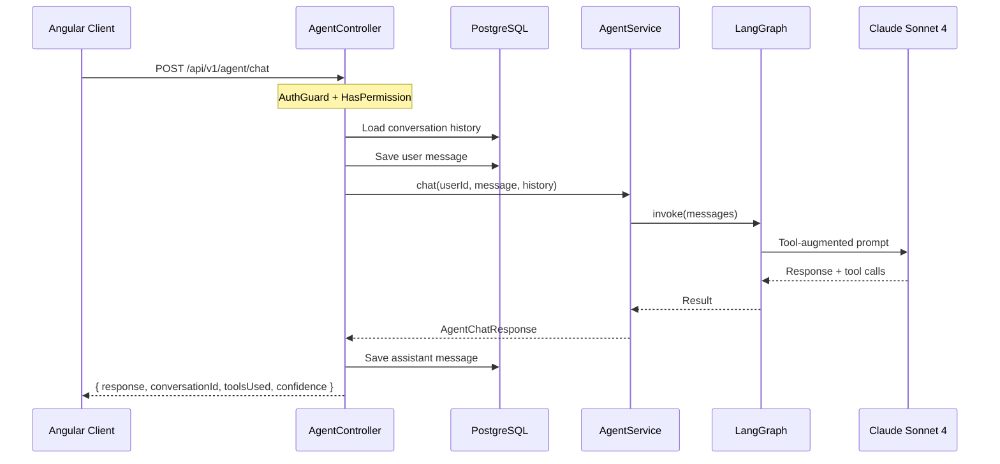

# Phase 4: Chat Endpoint & Basic UI

Corresponds to **Steps 14-16** of the [buildguide](/.cursor/plans/buildguide.md) (lines 305-392).

**Estimated time:** 2-3 hours with AI assistance.

---

## Decision: Angular Component (Option B)

The buildguide offers two UI options. We go with **Option B (Angular)** since:

- Ghostfolio is already an Angular app with full routing, auth, and theming
- ServeStaticModule serves the Angular client from `apps/api/src/assets/` but a standalone React HTML would not participate in Angular's auth flow (the JWT lives in an Angular service, not just localStorage)
- An Angular component gets proper routing, lazy loading, and access to the existing `DataService` pattern for HTTP calls

---

## Step 1: Add ChatMessage Prisma Model

Add a new model to [prisma/schema.prisma](prisma/schema.prisma). Follow existing conventions (UUID id, `@default(now())` timestamps, `@@index` on foreign keys, `onDelete: Cascade` on User relation):

```prisma
model ChatMessage {
  id             String   @id @default(uuid())
  conversationId String
  userId         String
  user           User     @relation(fields: [userId], onDelete: Cascade, references: [id])
  role           String   // 'user' | 'assistant'
  content        String
  toolCalls      Json?
  tokensUsed     Int?
  confidence     String?
  createdAt      DateTime @default(now())

  @@index([conversationId])
  @@index([userId])
}
```

Also add the back-reference to the User model:

```prisma
model User {
  // ... existing fields ...
  chatMessages  ChatMessage[]
}
```

Then run migration:

```bash
npx prisma migrate dev --name add-chat-messages
npx prisma generate
```

---

## Step 2: Add `accessAgentChat` Permission

Add a new permission in [libs/common/src/lib/permissions.ts](libs/common/src/lib/permissions.ts):

- Add `accessAgentChat: 'accessAgentChat'` to the `permissions` const (line ~7, alphabetical order)
- Grant it to `ADMIN`, `DEMO` (read-only), and `USER` roles in `getPermissions()` — same places that already grant `readAiPrompt`

This keeps the agent chat behind the same permission tier as the existing AI features.

---

## Step 3: Create the Chat API Controller

Create new directory `apps/api/src/app/endpoints/agent/` with three files, following the existing [ai/ endpoint pattern](apps/api/src/app/endpoints/ai/):

### 3a. Request DTO: `agent-chat.dto.ts`

Use `class-validator` (matches the global `ValidationPipe` in `main.ts`):

```typescript
import { IsOptional, IsString, MaxLength } from 'class-validator';

export class AgentChatDto {
  @IsString()
  @MaxLength(4000)
  message: string;

  @IsOptional()
  @IsString()
  conversationId?: string;
}
```

### 3b. Controller: `agent.controller.ts`

- Route: `@Controller('agent')` -> resolves to `POST /api/v1/agent/chat`
- Auth: `@UseGuards(AuthGuard('jwt'), HasPermissionGuard)` + `@HasPermission(permissions.accessAgentChat)`
- Inject `REQUEST` as `RequestWithUser` for `this.request.user.id` and `this.request.user.settings.settings.baseCurrency`
- `@Post('chat')` handler:
  1. Extract or generate `conversationId` (use `randomUUID()` if not provided)
  2. Load conversation history from DB via `PrismaService` (filter by `conversationId + userId`, ordered by `createdAt`)
  3. Convert DB rows to LangChain `BaseMessage[]` (HumanMessage / AIMessage)
  4. Save the user's message to DB
  5. Call `agentService.chat(userId, message, history)`
  6. Save the assistant's response to DB
  7. Return `{ response, conversationId, toolsUsed, confidence }`
- Wrap in try/catch, return 500 with structured error on failure
- Add a `@Get('conversations')` endpoint to list user's conversations (distinct conversationIds with last message timestamp)
- Add a `@Get('conversations/:conversationId')` endpoint to load a specific conversation's messages

### 3c. Module: `agent-endpoint.module.ts`

```typescript
@Module({
  controllers: [AgentController],
  imports: [AgentModule, PrismaModule],
  providers: [AgentController]
})
export class AgentEndpointModule {}
```

Register this module in [apps/api/src/app/app.module.ts](apps/api/src/app/app.module.ts) imports array (next to `AiModule`).

---

## Step 4: Build the Angular Chat UI

### 4a. Create the component at `apps/client/src/app/pages/agent-chat/`

Files:

- `agent-chat-page.component.ts` (standalone component)
- `agent-chat-page.component.html`
- `agent-chat-page.component.scss`

Component features:

- Chat bubble layout: user messages aligned right, agent messages aligned left
- Text input with send button (disabled while loading)
- Loading indicator (typing dots animation) while awaiting response
- Tool badges below agent messages showing which tools were used
- Confidence badge (color-coded: green=high, yellow=medium, red=low)
- Conversation list sidebar (collapsible) showing past conversations
- New conversation button
- Mobile responsive (sidebar collapses to a drawer)
- Use Ghostfolio's existing theme variables from `apps/client/src/styles/` for consistent look

### 4b. Add DataService methods

Add to [libs/ui/src/lib/services/data.service.ts](libs/ui/src/lib/services/data.service.ts):

```typescript
public postAgentChat({ message, conversationId }: { message: string; conversationId?: string }) {
  return this.http.post<AgentChatResponse>('/api/v1/agent/chat', { message, conversationId });
}

public fetchAgentConversations() {
  return this.http.get<AgentConversation[]>('/api/v1/agent/conversations');
}

public fetchAgentConversation(conversationId: string) {
  return this.http.get<AgentChatMessage[]>(`/api/v1/agent/conversations/${conversationId}`);
}
```

### 4c. Add interfaces

Add to [libs/common/src/lib/interfaces/](libs/common/src/lib/interfaces/) (or alongside the component):

```typescript
interface AgentChatResponse {
  response: string;
  conversationId: string;
  toolsUsed: string[];
  confidence: string;
}

interface AgentChatMessage {
  id: string;
  role: 'user' | 'assistant';
  content: string;
  toolCalls?: string[];
  confidence?: string;
  createdAt: string;
}

interface AgentConversation {
  conversationId: string;
  lastMessageAt: string;
  messageCount: number;
  preview: string;
}
```

### 4d. Add route

In [apps/client/src/app/app.routes.ts](apps/client/src/app/app.routes.ts), add a lazy-loaded route:

```typescript
{
  path: 'agent',
  loadComponent: () =>
    import('./pages/agent-chat/agent-chat-page.component').then(
      (m) => m.AgentChatPageComponent
    ),
  canActivate: [AuthGuard]
}
```

### 4e. Add navigation link

Add an "Agent Chat" link to the sidebar/nav, gated behind `permissions.accessAgentChat`. Look at how the existing AI prompt button is conditionally shown in the analysis page and follow the same pattern.

---

## Architecture




---

## Buildguide vs Reality: Key Corrections

- **Auth pattern:** Buildguide says `@AuthUser` decorator — this doesn't exist in the codebase. Use `@Inject(REQUEST) request: RequestWithUser` and access `this.request.user.id`
- **Route prefix:** Buildguide says `POST /api/v1/agent/chat` — this is correct since `main.ts` sets global prefix `/api` with default version `v1`
- **Conversation history:** Buildguide mentions storing in Prisma — we load/save via `PrismaService.chatMessage` operations, converting to LangChain `BaseMessage` types for the agent
- **UI:** We're going with Angular (Option B) instead of standalone React HTML for proper integration
- **Token from localStorage:** Not needed — Angular's `DataService` already attaches the JWT via an HTTP interceptor

---

## Implementation Order

1. Prisma schema + migration (must come first since controller depends on it)
2. Permission addition (needed before controller can use it)
3. Controller + DTO + module (backend complete, testable via curl/Postman)
4. Angular interfaces + DataService methods
5. Angular chat component + routing
6. Navigation link integration

