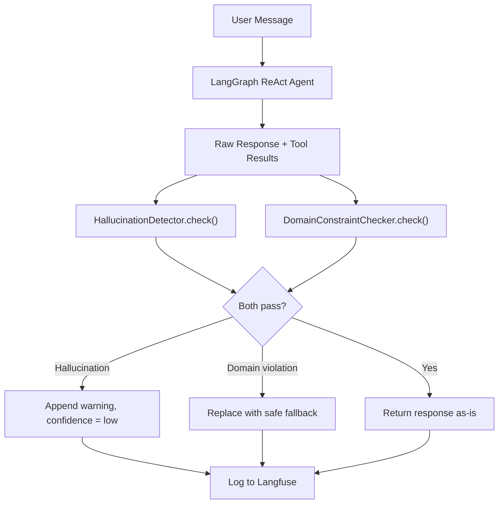

# Phase 5: Verification Layer

## Current State

- Agent service at `[libs/agent/src/lib/agent.service.ts](libs/agent/src/lib/agent.service.ts)` runs a ReAct LangGraph agent and returns `{ response, toolCalls, tokensUsed, confidence, latencyMs }`
- The `chat()` method currently extracts tool **names** (line 103-105) but discards the tool **content** — verification needs the raw tool outputs
- No `verification/` directory exists yet
- Langfuse tracing is already wired up with `trace?.update()` calls

## Architecture




## Critical Implementation Detail: Extracting Tool Results

The current `chat()` method only grabs tool names:

```103:105:libs/agent/src/lib/agent.service.ts
      const toolCalls = result.messages
        .filter((m: BaseMessage) => m.getType() === 'tool')
        .map((m: BaseMessage) => m.name ?? 'unknown');
```

We need to also extract tool **content** (the actual data returned). LangGraph `ToolMessage` objects have a `.content` property containing the JSON string each tool returned. We'll extract these alongside names into a `ToolCallResult[]` array:

```typescript
interface ToolCallResult {
  toolName: string;
  result: string; // raw JSON string from tool
}
```

## Files to Create

### 1. `libs/agent/src/lib/verification/hallucination-detector.ts`

- `**extractNumbers(text: string): NumberMatch[]**` — regex to pull dollar amounts (`$1,234.56`), percentages (`12.3%`), and plain numbers from a string. Returns value + original text span.
- `**extractTickers(text: string): string[]**` — regex for uppercase 1-5 letter sequences that look like stock symbols (filter out common words like "I", "A", "CEO", "ETF", etc.)
- `**numbersFromToolResults(toolResults: ToolCallResult[]): Set<number>**` — parse all tool result JSON, recursively walk values, collect every number (and derived values like sums, percentages of totals)
- `**tickersFromToolResults(toolResults: ToolCallResult[]): Set<string>**` — same walk, collect string values matching ticker pattern
- `**check(agentResponse: string, toolResults: ToolCallResult[]): HallucinationCheckResult**` — main entry point:
  - Extract numbers from response, check each against tool results set with tolerance (`Math.abs(a - b) / Math.max(Math.abs(a), 1) < 0.02` — 2% rounding tolerance)
  - Extract tickers from response, check each exists in tool results
  - Return `{ isValid, unsupportedClaims: string[], confidence: 'low' | 'medium' | 'high' }`

### 2. `libs/agent/src/lib/verification/domain-constraints.ts`

- **Forbidden patterns** (case-insensitive regex array):
  - Buy/sell recs: `you should (buy|sell|purchase)`, `I recommend (buying|selling|purchasing)`, `sell immediately`, `buy now`
  - Price targets: `(stock|price) will (reach|hit|go to) \$`
  - Guaranteed outcomes: `guaranteed (returns|profit)`, `you will (make|earn) \d+%`, `risk.free`
  - Copy-trade advice: `copy (pelosi|tuberville|their|his|her) trades`, `trade like`, `follow (their|his|her) trades`
- **Required elements** (when response discusses performance data — detect via presence of `$` or `%`):
  - Financial disclaimer substring: `not a financial advisor` or `not investment advice`
  - Confidence tag: `[Confidence: (Low|Medium|High)]`
- `**check(agentResponse: string): DomainConstraintResult`** — returns `{ passed, violations: string[], missingElements: string[] }`

### 3. `libs/agent/src/lib/verification/index.ts`

Barrel export for the verification module.

## Files to Modify

### 4. `libs/agent/src/lib/agent.service.ts`

Changes to the `chat()` method (between the `agentGraph.invoke()` call and the `return` statement):

- Extract `toolResults: ToolCallResult[]` from `result.messages` (filter for tool messages, grab both `.name` and `.content`)
- Call `HallucinationDetector.check(responseText, toolResults)`
- Call `DomainConstraintChecker.check(responseText)`
- If domain constraint fails: replace `responseText` with `"I can only provide factual portfolio analysis, not investment advice. Please rephrase your question to ask about specific portfolio data or metrics."`, set confidence to `'low'`
- If hallucination detected (`!isValid`): append `"\n\n⚠️ Note: Some figures in this response could not be verified against the source data. Please verify independently."`, set confidence to `'low'`
- Log verification results to Langfuse trace metadata:

```typescript
  trace?.span({
    name: 'verification',
    input: { responseLength: responseText.length, toolResultCount: toolResults.length },
    output: { hallucination: hallucinationResult, domainConstraint: domainResult }
  });
  

```

- Add `verified: boolean` to `AgentChatResponse` interface

### 5. `libs/agent/src/index.ts`

Add exports for verification types so consumers (controller, tests) can access them if needed.

## Testing Approach

- Unit tests for `hallucination-detector.ts`: pass known response + tool results, assert correct detection
- Unit tests for `domain-constraints.ts`: pass forbidden phrases, assert violations caught; pass clean responses, assert passing
- These are pure functions with no dependencies — fast, deterministic tests

