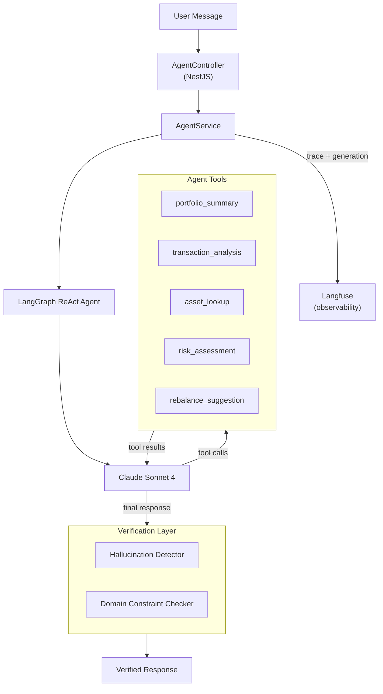

# AgentForge — Agent Library

The agent library (`libs/agent`) is the core AI module for AgentForge. It implements a LangGraph.js ReAct agent powered by Claude Sonnet 4 that answers questions about Ghostfolio investment portfolios. Every response is verified against raw tool output before reaching the user — fabricated numbers and investment advice are blocked automatically.

## Architecture



**Flow**: User message hits the NestJS controller, which passes it to `AgentService`. The service builds a LangGraph ReAct agent that reasons about which tools to call, executes them against Ghostfolio services, and synthesizes a response. Before returning, the verification layer checks every number and ticker against tool output (hallucination detection) and scans for forbidden patterns like buy/sell recommendations (domain constraints). Token usage and traces are sent to Langfuse.

## Setup

### Prerequisites

- Node.js >= 22
- PostgreSQL + Redis (via Docker or standalone)
- Anthropic API key (`ANTHROPIC_API_KEY`)

### Environment Variables

| Variable | Required | Description |
|----------|----------|-------------|
| `ANTHROPIC_API_KEY` | Yes | Claude API key for the LLM |
| `LANGFUSE_PUBLIC_KEY` | No | Langfuse public key (enables observability) |
| `LANGFUSE_SECRET_KEY` | No | Langfuse secret key (enables observability) |

### Install and Run

```bash
npm install
docker compose -f docker/docker-compose.dev.yml up -d
npx prisma migrate deploy
npm start
```

The agent endpoint is available at `POST /api/v1/agent/chat` (requires JWT auth).

## Congressional Portfolio Seeding

The project includes a seeding script that imports real U.S. congressional STOCK Act financial disclosures as Ghostfolio portfolios. Six politicians are seeded as test archetypes:

| Politician | Portfolio Character |
|------------|-------------------|
| Nancy Pelosi | Large, tech-heavy (AAPL/NVDA/MSFT dominant) |
| Tommy Tuberville | High-frequency trader (300+ trades, mixed sectors) |
| Dan Crenshaw | Moderate, diversified (healthcare, energy, tech) |
| Ron Wyden | Conservative, index-heavy (VTI, BND, VXUS) |
| Marjorie Taylor Greene | Concentrated, high-risk (TSLA/DJT heavy) |
| Josh Gottheimer | Small, finance-focused (JPM, GS, BAC) |

```bash
npx ts-node prisma/seed-congressional-portfolios.ts
```

The script fetches trade data from the House/Senate Stock Watcher APIs, maps STOCK Act disclosure ranges to midpoint dollar amounts, looks up historical prices via Yahoo Finance, and creates Ghostfolio activity records.

## Running Tests

### Unit Tests (fast, no LLM)

Pure-function tests for the verification layer:

```bash
npx jest --config libs/agent/jest.config.ts --testPathPatterns="(hallucination|domain)"
```

### Eval Suite (real LLM, mock services)

50 tests across 4 categories that invoke the real LangGraph agent against Claude Sonnet 4 with mocked Ghostfolio services returning realistic congressional portfolio data.

```bash
npx jest --config libs/agent/jest.config.ts --testPathPatterns=agent-eval
```

| Category | Count | What It Tests |
|----------|-------|---------------|
| Happy Path | 20 | Portfolio queries, asset lookups, transactions, risk, rebalancing |
| Edge Cases | 10 | Few holdings, missing asset classes, unusual allocations |
| Adversarial | 10 | Copy-trade refusal, jailbreaks, prompt injection |
| Multi-Step | 10 | Cross-portfolio comparison, multi-tool orchestration |

Requires `ANTHROPIC_API_KEY`. Takes ~8 minutes (real API calls). Results are pushed to Langfuse as the `agentforge-congressional-evals` dataset.

### Smoke Test (live endpoint)

```bash
BASE_URL=https://your-app.up.railway.app ACCESS_TOKEN=your-token npx ts-node scripts/smoke-test.ts
```

Sends 5 representative queries to the deployed chat endpoint and validates responses.

## Tool Reference

| Tool | Input Schema | Output | Ghostfolio Service |
|------|-------------|--------|-------------------|
| `portfolio_summary` | `{ userId: string }` | Total value, holdings (symbol, name, allocation %, value, quantity), performance (1D, 1M, YTD, 1Y) | `PortfolioService.getDetails()` + `getPerformance()` |
| `transaction_analysis` | `{ userId: string, startDate?: string, endDate?: string, userCurrency?: string }` | Trade count, buy/sell breakdown, total fees, most traded symbols | `OrderService.getOrders()` |
| `asset_lookup` | `{ symbol: string, dataSource?: string }` | Current price, 52-week high/low, sector, country, asset profile | `DataProviderService.getQuotes()` + `getAssetProfiles()` |
| `risk_assessment` | `{ userId: string }` | Concentration risk (>25% flags), sector allocation, geographic diversification, asset class balance | `PortfolioService.getDetails()` |
| `rebalance_suggestion` | `{ userId: string, targetAllocation: Record<string, number> }` | Current vs target allocation delta, specific trade suggestions with dollar amounts (read-only) | `PortfolioService.getDetails()` |

All tools use Zod schemas for input validation, return JSON strings, and include `try/catch` error handling.

## Verification Layer

Every agent response passes through two checks before reaching the user:

### Hallucination Detector (`verification/hallucination-detector.ts`)

- Extracts all numbers (dollar amounts, percentages, quantities) from the response
- Extracts ticker symbols (filters common English words)
- Validates each extracted value against tool output data
- Allows 2% rounding tolerance for derived calculations (sums, percentages)
- Returns `{ isValid, unsupportedClaims[], confidence }`
- If invalid: response gets a warning appended and confidence is lowered to `low`

### Domain Constraint Checker (`verification/domain-constraints.ts`)

- Scans for forbidden patterns: buy/sell recommendations, price targets, guaranteed outcomes, copy-trade suggestions
- Checks for required elements: financial disclaimer (when discussing performance), confidence indicator (`[Confidence: Low/Medium/High]`)
- Returns `{ passed, violations[], missingElements[] }`
- If violated: response is replaced entirely with a safe fallback message

## File Structure

```
libs/agent/src/lib/
├── __tests__/
│   ├── agent-eval.spec.ts              # 50-test eval suite (real LLM)
│   ├── hallucination-detector.spec.ts  # Unit tests
│   ├── domain-constraints.spec.ts      # Unit tests
│   ├── eval-helpers.ts                 # Shared test utilities
│   └── langfuse-reporter.ts            # Pushes eval results to Langfuse
├── tools/
│   ├── portfolio-summary.tool.ts
│   ├── transaction-analysis.tool.ts
│   ├── asset-lookup.tool.ts
│   ├── risk-assessment.tool.ts
│   └── rebalance-suggestion.tool.ts
├── verification/
│   ├── hallucination-detector.ts
│   ├── domain-constraints.ts
│   └── verification.types.ts
├── agent.graph.ts                      # LangGraph ReAct agent + system prompt
├── agent.module.ts                     # NestJS module
└── agent.service.ts                    # Orchestrates graph + verification + Langfuse
```

## Contributing

1. Follow the existing code patterns — read similar files before writing new code
2. Use TypeScript strict mode, no `any` types
3. Use Zod for runtime validation of tool inputs
4. Use NestJS dependency injection — never instantiate services with `new`
5. All tools must include `try/catch` and return structured error objects
6. Add unit tests for new verification logic
7. Add eval test cases for new tools or behavior changes
8. Run `npx nx lint agent` before submitting

## License

AGPL-3.0 — matching [Ghostfolio](https://github.com/ghostfolio/ghostfolio).
